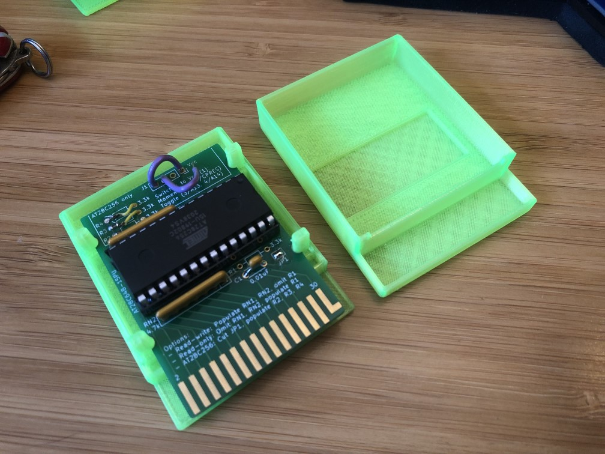
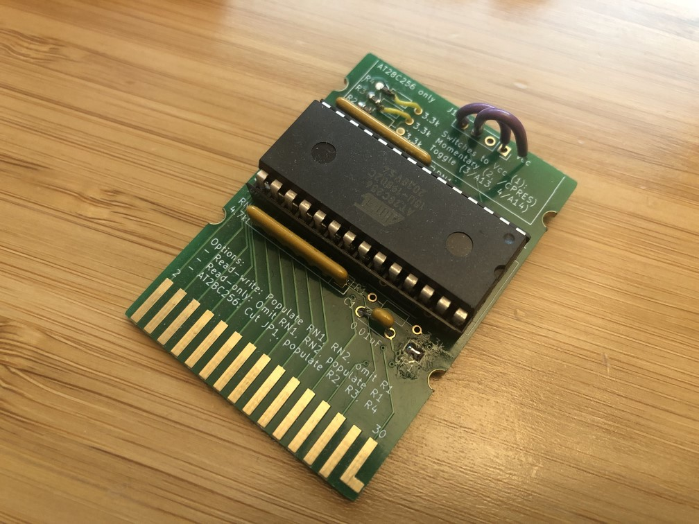

# Ensoniq ESQ-1 EEPROM Cartridge

This repo contains an open source hardware design for a EEPROM-based patch storage cartridge for the Ensoniq ESQ-1 and SQ-80 hybrid synthesizers.

## Assembly Details

Latest assembly instructions and errata can be found in the PDF at the root of this repo.

The PCB is designed to support AT28C64 and AT28C256 (or similar) EEPROM's. The larger EEPROM option can be controlled using 2 switches (purple wires in the photo below).

The cartridge can also be configured as a "read-only" cartridge with some reducion in parts count.

The current 3D printed enclosure design is provided as a Fusion 360 file. The two halves of the case are inteded to be held together either using a press fit or with clear packing tape. Not elegant, but it works.

## Where can I purcahse one?

Unpopulated PCB's can be ordered from the ZenSynth store on Tindie: 

https://www.tindie.com/products/zensynth/oshdiy-ensoniq-esq-1sq-80-eeprom-cartridge/

## Additional Resources

A very special thanks to Rainer Buchty for his help bringing this project to life! Thank you for the chats and resources!

If you haven't already found his wonderfully detailed site dedicated to Ensoniq synthesizers, you're missing out: http://www.buchty.net/ensoniq/
